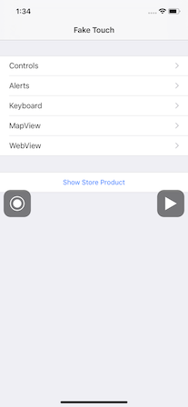

# FakeTouch

[](https://opensource.org/licenses/MIT)

The FakeTouch framework allows you to recording / simulating the iOS touch events.

This project was created using part of the [KIF](https://github.com/kif-framework/KIF) project and referring to [PTFakeTouch](https://github.com/Retr0-star/PTFakeTouch) and [ZSFakeTouch](https://github.com/Roshanzs/ZSFakeTouch) project.


- [Features](#Features)
- [Getting Started](#getting-started)
    - [Requirements](#requirements)
    - [Installation](#installation)
- [Usage](#usage)
    - [Initialization](#initialization)
    - [Recording Touch Event](#recording-touch-event)
    - [Playing Touch Event](#playing-touch-event)
- [Author](#author)
- [License](#license)
- [Acknowledgments](#acknowledgments)

## Features
- [x] Simulates Touch Event.
- [x] Recorder / Player class for Touch Event.

## Getting Started

### Requirements

* iOS 12.0+
* Xcode 10.0+
* Swift 4.2+

### Installation

**[Cocoa Pods](https://cocoapods.org)**

```sh
pod "FakeTouch", :git => 'https://github.com/watanabetoshinori/FakeTouch.git', :branch => 'master'
```

## Usage

### Initialization

Start by importing the package in the file you want to use it.

```swift
import FakeTouch
```

### Recording Touch Event

Record the touch event and make it available later.

#### Initializing Recorder

```swift
let recorder = TouchRecorder.shared
```

#### Controlling Recording

```swift
// Start recording
recorder.record { [weak self] (events, error) in
    if let error = error {
        print(error)
        return
    }
    
    // Keep events for playing later.
    self?.events = events
}

// Stop recording
recorder.stop()
```

### Playing Touch Event

Play a touch event captured with the recorder.

#### Initializing Player

````swift
let player = TouchPlayer(events: events)

// Keeping instance
self.player = player
````

#### Controlling Playback

```swift
// Start simulation
player.play(finishPlayHandler: { [weak self] (error) in
    if let error = error {
        print(error.localizedDescription)
        return
    }
})

// Stop simulation
player.stop()
```

### Import and Export Touch Event

Touch event supported JSON Codable protocol.
You can export / import touch events.

#### Export

```swift
let documentDirectoryURL = FileManager.default.urls(for: .documentDirectory, in: .userDomainMask).first!
let jsonFileURL = documentDirectoryURL.appendingPathComponent("events.json")

do {
    let data = try JSONEncoder().encode(events)
    try data.write(to: jsonFileURL)

} catch {
    print(error)
}
```

#### Import

```swift
let documentDirectoryURL = FileManager.default.urls(for: .documentDirectory, in: .userDomainMask).first!
let jsonFileURL = documentDirectoryURL.appendingPathComponent("events.json")

do {
    let data = try Data(contentsOf: jsonFileURL)
    let events = try JSONDecoder().decode([TouchEvent].self, from: data)
    self.events = events

} catch {
    print(error)
}
```

## Example App

Example App for FakeTouch. See the [Example](Example) directory.



## Author

Watanabe Toshinori – toshinori_watanabe@tiny.blue

## License

This project is licensed under the MIT License. See the [LICENSE](LICENSE) file for details.

This project uses some [KIF](https://github.com/kif-framework/KIF) source code. They are under the [KIF's License](Source/KIF/LICENSE).

## Acknowledgments

This project refers to the code of the following projects:

* [KIF](https://github.com/kif-framework/KIF)
* [PTFakeTouch](https://github.com/Retr0-star/PTFakeTouch)
* [ZSFakeTouch](https://github.com/Roshanzs/ZSFakeTouch)
